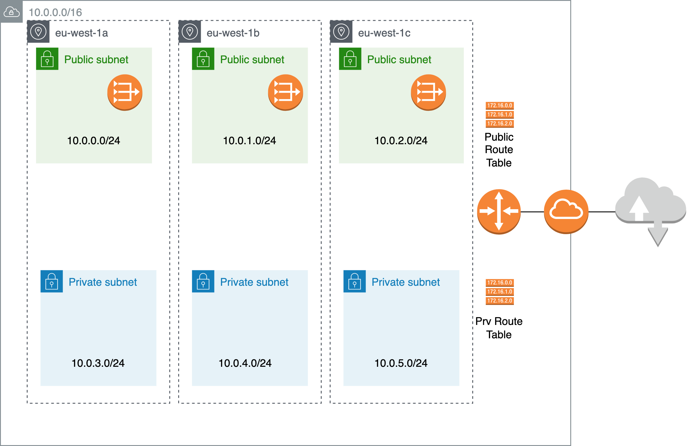

# Demo VPC, IGW, Public & Private Subnets

This repository creates a VPC, IGW, public and private subnets and route tables. 

## Architecture

The following will be created: 



## Configuring S3 Backend

This project can be configured to use S3 as a backend to store the state file. In addition a DynamoDB locks table will be created. 

To enable S3 first set the varible `backend_enabled` to `true`. Then run a `terraform innit` and `terraform apply`. Once applied you can now change `versions.tf` and enable backend support.

```
terraform {
   backend "s3" {
     bucket         = "ENTER_BUCKET_NAME"
     key            = "terraform_vpc/terraform.tfstate"
     region         = "eu-west-1"
     encrypt        = true
     kms_key_id     = "ENTER_KMS_ID"
     dynamodb_table = "ENTER_DYNAMODB_TABLE_NAME"
   }
   // other terraform configuration
}
```
These values can be gathered from the outputs from the `terraform apply`.

## Requirements

| Name | Version |
|------|---------|
| <a name="requirement_aws"></a> [aws](#requirement\_aws) | 4.10.0 |

## Providers

| Name | Version |
|------|---------|
| <a name="provider_aws"></a> [aws](#provider\_aws) | 4.10.0 |

## Modules

| Name | Source | Version |
|------|--------|---------|
| <a name="module_remote-state-s3-backend"></a> [remote-state-s3-backend](#module\_remote-state-s3-backend) | nozaq/remote-state-s3-backend/aws | 1.2.0 |

## Resources

| Name | Type |
|------|------|
| [aws_eip.nat](https://registry.terraform.io/providers/hashicorp/aws/4.10.0/docs/resources/eip) | resource |
| [aws_internet_gateway.igw](https://registry.terraform.io/providers/hashicorp/aws/4.10.0/docs/resources/internet_gateway) | resource |
| [aws_nat_gateway.nat](https://registry.terraform.io/providers/hashicorp/aws/4.10.0/docs/resources/nat_gateway) | resource |
| [aws_route.private_nat_gateway](https://registry.terraform.io/providers/hashicorp/aws/4.10.0/docs/resources/route) | resource |
| [aws_route.public_internet_gateway](https://registry.terraform.io/providers/hashicorp/aws/4.10.0/docs/resources/route) | resource |
| [aws_route_table.private](https://registry.terraform.io/providers/hashicorp/aws/4.10.0/docs/resources/route_table) | resource |
| [aws_route_table.public](https://registry.terraform.io/providers/hashicorp/aws/4.10.0/docs/resources/route_table) | resource |
| [aws_route_table_association.private](https://registry.terraform.io/providers/hashicorp/aws/4.10.0/docs/resources/route_table_association) | resource |
| [aws_route_table_association.public](https://registry.terraform.io/providers/hashicorp/aws/4.10.0/docs/resources/route_table_association) | resource |
| [aws_security_group.default](https://registry.terraform.io/providers/hashicorp/aws/4.10.0/docs/resources/security_group) | resource |
| [aws_subnet.private](https://registry.terraform.io/providers/hashicorp/aws/4.10.0/docs/resources/subnet) | resource |
| [aws_subnet.public](https://registry.terraform.io/providers/hashicorp/aws/4.10.0/docs/resources/subnet) | resource |
| [aws_vpc.main](https://registry.terraform.io/providers/hashicorp/aws/4.10.0/docs/resources/vpc) | resource |

## Inputs

| Name | Description | Type | Default | Required |
|------|-------------|------|---------|:--------:|
| <a name="input_availability_zones"></a> [availability\_zones](#input\_availability\_zones) | n/a | `list(string)` | <pre>[<br>  "eu-west-1a",<br>  "eu-west-1b",<br>  "eu-west-1c"<br>]</pre> | no |
| <a name="input_backend_enabled"></a> [backend\_enabled](#input\_backend\_enabled) | n/a | `bool` | `false` | no |
| <a name="input_cidr_block"></a> [cidr\_block](#input\_cidr\_block) | VPC cidr block. Example: 10.0.0.0/16 | `string` | `"10.0.0.0/16"` | no |
| <a name="input_region"></a> [region](#input\_region) | AWS Region | `string` | `"eu-west-1"` | no |
| <a name="input_replica_region"></a> [replica\_region](#input\_replica\_region) | Region in which S3 bucket to be replicated. | `string` | `"eu-west-2"` | no |

## Outputs

| Name | Description |
|------|-------------|
| <a name="output_dynamodb_table"></a> [dynamodb\_table](#output\_dynamodb\_table) | n/a |
| <a name="output_kms_key"></a> [kms\_key](#output\_kms\_key) | n/a |
| <a name="output_state_bucket"></a> [state\_bucket](#output\_state\_bucket) | n/a |